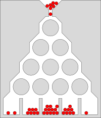
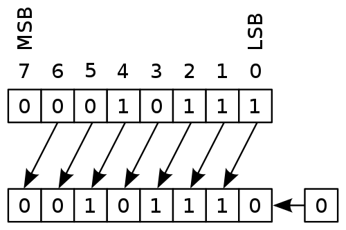
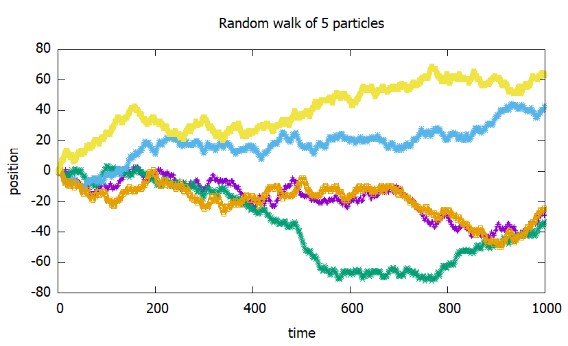
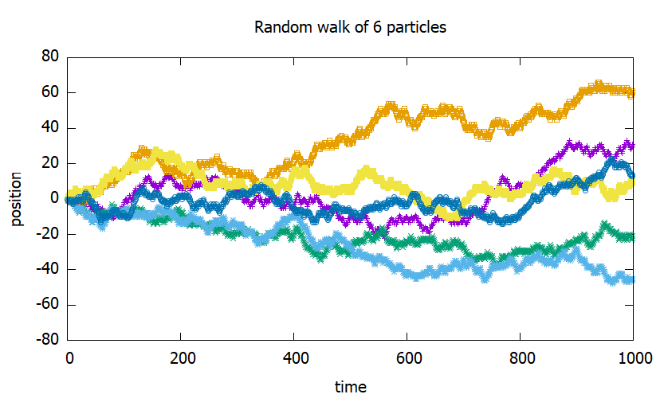

# Deterministic, non-deterministic and stochastic

what's the difference between deterministic, non-deterministic and stochastic?

## deterministic processes

Classical (non-quantum) physics is deterministic:

- rolling and colliding balls, planets and pendulums
- cars, computers, AI driven robots

**hard** to predict (would be possible):

- gravitational N-body problem (N>2)
- double pendulum
- pollen particles making random walks

------------------

# Deterministic, non-deterministic and stochastic II

## non-deterministic processes

In quantum physics, some behaviour is not deterministic:

- measuring the position after measuring the speed, or vica versa
- measuring the spin of an electron in the axis x after mesuring it in another axis
- radioactive decay

 Even knowing all the details of the system does not predict the behavior of the system completely.

### Is finance truly non-deterministic?

- Chlorophyll uses quantum effects to produce oxigen
- maybe the human brain also has quantum effects, therefore it can be non-deterministic, and finance is influenced by human behavior

------------------

# Deterministic, non-deterministic and stochastic III

## Stochastic process

{ width=2cm }\

- a process is stochastic, if one of the properties of the system, for an observer, *cannot be determined* by the system and its interaction with its environment, and therefore the property is considered as a random variable
  - **deterministic** but we don't have precise enough info (Galton Board)
  - **non-deterministic** (electron scattering - model for electrical resistance)
- only partially stochastic: we detach the part we can describe in a deterministic manner, and suppose that the leftover is purely stochastic (decoupling)

------------------

# Applications

- classical physical problems:
  - [double pendulum](https://en.wikipedia.org/wiki/Double_pendulum#/media/File:Trajektorie_eines_Doppelpendels.gif): after long time, we cannot tell the position of the pendulums (chaos)
  - random walk of pollen particles
  - PhD topic: collective motion of crystalline defects
- financial systems

{ width=2.5cm }

------------------

# Properties of the stochastic approach

## Type of prediction

- one cannot predict exactly what happens with 1 system, but
- statistical statements can be still be made.

## Type of calculation

- analytical predictions are rare (Brownian motion)
- discrete, case-base calculations: Monte Carlo simulations

------------------

# Monte Carlo simulations

We would like to predict the outcome of a stochastic process. We can investigate the outcomes by starting the system

- from identical initial settings and developing it in a non-deterministic way
- from *statistically* identical settings and developing it in (a deterministic or) non-deterministic way

How can a computer, that is deterministic, make non-deterministic calculation?

- include a non-deterministic hardware that generates true random numbers (digital amplifier, radioactive material)
- use strange functions that generates numbers that look like random, pseudo random

------------------

# pseudo random numbers - history

John von Neumann (computer science, chemistry, physics, mathematics) worked in the Manhattan project:

- true random number generators are bad
  - too slow
  - cannot be reproduced for debugging
- to store them and read back is still slow and consumes a lot of space
- let's invent pseudo random number generation!

------------------

# middle-square method

(Excel)

- very fast, can be easily implemented on binary numbers
- some values are prohibited
- loops ($a \to b \to a$) are frequent for smaller $n$
- can be improved with *Weyl-sequence*:
$${a_i} = {s^i}\% m$$
  - where $s$ and $m$ are relative-primes (for 32-bit int, $m = {2^{32}}$, and modulo is just cutting the surplus bits)
  - $a_i$ will be uniformly distributed on $\left[ {0,m} \right)$
  - similar to the statement that 1, 2, $\ldots$, $n$, $\ldots$ are uniformly distributed on the unit circle
  - improve middle-square method (apply modulo everywhere):
$$r\left( i \right) = {\text{middle bits}}\left( {{{\left( {{r_{i - 1}}} \right)}^2} + {s^i}} \right)$$

------------------

# LCG class

Linear congruential generator (Excel)
$${r_i} = \left( {a \cdot {r_{i - 1}} + b} \right)\% m$$

Some set of values are exceptionally good. Periodic in $m = 2^{32}$.

## Generalizing prngs

- The *i*th random number is generated as
$${r_i} = f\left( {{r_{i - 1}},{r_{i - 2}}, \ldots ,{r_{i - n}}} \right)$$
- The first $n$ numbers are the seeds.
- Maximum length of period: ${\left( {{\text{largest number}}} \right)^n} = {2^{32n}}$

------------------

# LFSR, GFSR and TGFSR

- Linear feedback shift registers (Excel): random sequence of 0 and 1
- Generalised feedback shift registers, not only 0 and 1
  - group $w=32$ bits into a group of units (words), interpret them as numbers
$${r_i} = {r_{i - n}} \oplus {r_{i - m}}$$
  - wlog $n>m$, the period is ${2^n}$, which is much smaller than the  ${2^{w \cdot n}}$
- TGFSR: twisted GFSR, twisting one of the parameter:
$${r_i} = {r_{i - n}} \oplus A{r_{i - m}}$$
- $A$ is a matrix with size of $w \times w = 32 \times 32$ consisting 0s and 1s.

------------------

# Mersenne twister I

A tempered TGFSR.
$${r_i} = {r_{i - n}} \oplus A{r_{i - m}},$$

The random numbers are not the ${\left( {{r_i}} \right)_{i \in \mathbb{N}}}$, but a set of bitwise functions (shifting, masking, modifying) are applied:
$$y: = {r_i} \oplus \left( {{r_i} >  > 11} \right)$$
$$y: = y \oplus \left( {\left( {y <  < 7} \right)\& b} \right)$$
$$y: = {r_i} \oplus \left( {\left( {y <  < 15} \right)\& c} \right)$$
$${R_i}: = y \oplus \left( {y >  > 18} \right)$$
{ width=4cm }

------------------

# Mersenne twister II

Properties (as of 1997):

- 32-bit implementation
- the internal state consist of 623 numbers: period of ${2^{623 \cdot 32}} - 1$ but $\left( {623 \cdot 32} \right)/8 \approx 2.5$ KB memory
- pass most of the random number tests
- moderately fast
- if the initial seeds are not random enough, it takes a while to generate good random numbers
- similar states remains similar for a long period of time
- a sequence of 624 numbers will predict the upcoming numbers (cryptographically unsecure)

------------------

# Mersenne twister III

- the most tested and used prng
- limitations are well known and in most cases, not important
- implementations can be found in most programming languages
- there are variants with
  - smaller state with a trade off of smaller period
  - optimization for modern CPUs with SIMD instruction set
  - optimization for GPU
  - cryptographical capabilities (patented)

------------------

# prng tests

Why do we need prngs and what kind of do we need?

- computers became faster and cheaper
  - computer simulation became an elementary tool in research and industry
  - Monte Carlo simulations became feasible on larger scales
  - need for better and faster prng is emerging
- Test the quality of the generated random numbers.
- List of standardized tests instead of visual inspection.

------------------

# prng tests passed by MT

MT passes the Diehard tests and most from the Big Crush test.
{ width=2cm float=right}\

## Diehard

A set of 12 tests published in 1995. A set of good random numbers are issued on a CD.

- Birthday spacings: Choose random points on a large interval. The spacings between the points should be asymptotically exponentially distributed
- Overlapping permutations: Analyze sequences of 5 consecutive random numbers. The possible orderings should occur with statistically equal probability. (How many orderings are possible?)

------------------

# prng tests not passed by MT I

MT fails on 2 similar tests from the Big Crush test set measuring complexity:

- select some of the bits of the random numbers (e.g. the 5th and the 11th)
- concetanate the same bits from the subsequent random numbers (e.g. 2 bits from every random number)
- resulting sequence should be also random, but more precisely, this test checks for its linear complexity
  - how many bits of information is required to regenerate the sequence (how large the sequence is if we compress it with a zip algorithm?)

------------------

# prng tests not passed by MT II

## Fail I

The number of jumps to reach a bit-length of $n$ (e.g. by $n/2$ random numbers) must be a normal-distribution for large enough $n$.

## Fail II

As the bit-length increases, the size of the jumps will increase too. To reach a bit-length of $n$ (e.g. by $n/2$ random numbers), jumps with different sizes will occur. Its distribution must be a geometric distribution with $p=0.5$.

------------------

# implementations in python and c++

Both languages offer a simple, old way to generate random numbers, and a newer, better way too.

------------------

# implementation in python - the default way

```python
  import random

  random.seed(1000)
  random.random() # 0.967...
  random.random() # 0.305...
```

If seed is not provided, time is used. Don't do that!

Drowback: only 1 prng instance can be used.

Only 1 seed value is provided, how about the remaining 623?

The underlying engine is the MT and is OS independent, but can be Python-dependent.

------------------

# implementation in python - with numpy

```python
  import numpy as n

  inst1 = n.random.Generator(n.random.MT19937(1000))
  inst2 = n.random.Generator(n.random.MT19937(1001))

  inst1.random()  # 0.861..., advances the state
  inst2.random()  # 0.750..., advances the state
  inst1.random(100) # generates 100 random numbers
```

The default underlying engine is not MT, but a not so well tested, much faster engine. Given the seed and engine type, the sequence should be the same.

------------------

# implementation in C++ - the default way

```cpp
  #include <cstdlib>
  ...
  srand(1000)   // seed
  std::cout << rand() << "\n" << rand();
```

No guarantee that different stl implementations give the same sequence. (e.g. MSVC vs GCC)

------------------

# implementation in C++ - the C++11 way

```cpp
  #include <random>
  ...
  std::mt19937 inst1(1000); // prng
  std::mt19937 inst2(1001); // prng
  std::cout << inst1() << "\n" << inst2();
```

No guarantee that different compilers give the same sequence. To ensure that, use the same library, even with different compilers (e.g. boost with MSVC or GCC)

The internal state can be advanced by 1 without generating the random numbers.

------------------

# A naiive random walk implementation

In case of **non-interacting** entities (particles):

```python
  P = 5     # number of particles
  T = 1000  # time steps

  prng_inst = n.random.Generator(n.random.MT19937(1000))
  pos = [[0] for i in range(P)]           # particles' pos
  for i in range(1, T):                   # time evol
      for j in range(P):
          if prng_inst.random() > 0.5:    # move up
              pos[j].append(pos[j][-1] + 1)
          else:                           # move down
              pos[j].append(pos[j][-1] - 1)
```

------------------

# Improve the naiive random walk implementation

1. increasing the number of particles produces completely different result
   - simulations cannot be compared directly
   - only statistical comparison can be made
2. simulation cannot be parallelized, because different particles share the same prng instance.

    **Assign a prng instance to a particle!**

3. If the time evolution depends on the actual state, there is no need to store previous states.

------------------



------------------



------------------

## The improved random walk implementation

```python
  for j in range(P):          # for every particle
      pos = []                # particle's pos
      prng_inst = n.random.Generator(n.random.MT19937(P))
      for i in range(1, T):   # time evolution
          if prng_inst.random() > 0.5:  # move up
              pos.append(pos[-1] + 1)
          else:                         # move down
              pos.append(pos[-1] - 1)
```

This version is better in:

- saving memory, because only 1 particle's position is stored in the memory at a time
- adding further particles does not affect the previously investigated particles
- can be parallelized easily, because particles are computationally independent too

------------------

# The problem of close seed values

Is it a good practice to seed the different simulations from ajdacents seed values? E.g. particle 1, 2, 3 from seed values 1, 2 and 3?

- close seed values can produce correlated values (how correlated?), but still better than using
  - time
  - user input
  - write a faulty seed-generating engine that produces the same random numbers
- maybe the seed is to pre-seed a pre-prng to generate proper seed values
- implementation-specific
- seed sequence solves this problem
